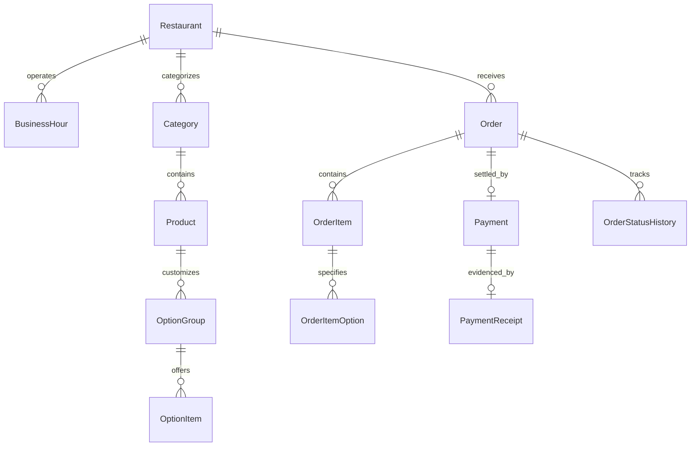

# Relational Database Schema & Data Models

## 1. Entity Relationship Overview

The schema is defined using Prisma ORM. It balances normalization for relational integrity with historical snapshotting for financial and audit compliance.

---

## 2. Core Entities & Table Definitions

### 2.1 Restaurant & Operational Settings
- `id`: String (UUID / CUID)
- `nameAr`: "بيتزا هاوس"
- `nameEn`: "Pizza House"
- `slug`: "pizza-house-mukalla"
- `phone`: "05375561"
- `whatsapp`: "+967772207788"
- `addressAr`: "المكلا - فوه - حي المساكن - بالقرب من جامعة الأحقاف"
- `addressEn`: "Mukalla, Fuwa, Al-Masaken District, Near Al-Ahgaff University"
- `currency`: "YER"
- `isOnlineOrderingPaused`: Boolean (default: false)
- `pauseMessageAr`: String (optional)
- `pauseMessageEn`: String (optional)
- `defaultPrepDuration`: Integer (minutes, default: 15)
- `slotCapacityMax`: Integer (orders per 15-min window, default: 8)

### 2.2 BusinessHour
- `id`: String
- `restaurantId`: String
- `dayOfWeek`: Integer (0 = Sunday, ..., 6 = Saturday)
- `shiftName`: String ("Morning" / "Evening")
- `openTime`: String ("08:00" / "16:00")
- `closeTime`: String ("12:00" / "23:30")
- `isClosed`: Boolean

### 2.3 Category & Product Catalog
- `Category`: `id`, `nameAr`, `nameEn`, `slug`, `sortOrder`, `isActive`.
- `Product`: `id`, `categoryId`, `nameAr`, `nameEn`, `descriptionAr`, `descriptionEn`, `basePrice` (Integer YER), `imageUrl`, `isAvailable`, `isFeatured`, `sortOrder`.
- `OptionGroup`: `id`, `productId`, `nameAr`, `nameEn`, `type` ("RADIO" / "CHECKBOX"), `isRequired`, `minSelect`, `maxSelect`.
- `OptionItem`: `id`, `optionGroupId`, `nameAr`, `nameEn`, `priceDelta` (Integer YER, e.g. +1000 for Stuffed Crust), `isAvailable`.

### 2.4 Order & Order Items (Historical Snapshotting)
- `Order`:
  - `id`: String (UUID)
  - `orderNumber`: String (unique, human-readable, e.g. `#PH-1024`)
  - `customerName`: String
  - `customerPhone`: String
  - `pickupMode`: String ("ASAP" / "SCHEDULED")
  - `requestedPickupTime`: DateTime
  - `plannedPrepStartTime`: DateTime
  - `actualPrepStartTime`: DateTime (nullable)
  - `readyTime`: DateTime (nullable)
  - `completedTime`: DateTime (nullable)
  - `status`: Enum (`PENDING`, `PAYMENT_PENDING`, `CONFIRMED`, `QUEUED`, `PREPARING`, `READY`, `COMPLETED`, `CANCELLED`, `REJECTED`)
  - `subtotal`: Integer (YER)
  - `discount`: Integer (YER)
  - `total`: Integer (YER)
  - `notes`: String (optional)
  - `createdAt`: DateTime
- `OrderItem`:
  - `id`: String
  - `orderId`: String (FK $\to$ Order)
  - `productId`: String (FK $\to$ Product)
  - `productNameAr`: String (snapshotted)
  - `productNameEn`: String (snapshotted)
  - `unitPrice`: Integer (snapshotted)
  - `quantity`: Integer
  - `subtotal`: Integer
  - `itemNotes`: String (optional)
- `OrderItemOption`:
  - `id`: String
  - `orderItemId`: String (FK $\to$ OrderItem)
  - `groupNameAr`: String (snapshotted)
  - `optionNameAr`: String (snapshotted)
  - `priceDelta`: Integer (snapshotted)

### 2.5 Payment & Receipts
- `Payment`:
  - `id`: String
  - `orderId`: String (unique FK $\to$ Order)
  - `method`: String (`PAY_AT_PICKUP`, `TRANSFER_KURAIMI`, `TRANSFER_AMQI`, `TRANSFER_BUSAIRI`)
  - `status`: Enum (`UNPAID`, `PENDING_VERIFICATION`, `VERIFIED`, `REJECTED`)
  - `amount`: Integer (YER)
  - `referenceNumber`: String (optional, e.g. bank slip ID)
  - `verifiedAt`: DateTime (nullable)
  - `verifiedBy`: String (nullable)
  - `rejectReason`: String (nullable)
- `PaymentReceipt`:
  - `id`: String
  - `paymentId`: String (unique FK $\to$ Payment)
  - `fileUrl`: String
  - `fileName`: String
  - `mimeType`: String
  - `fileSize`: Integer
  - `uploadedAt`: DateTime

### 2.6 AuditLog & AnalyticsEvent
- `AuditLog`: `id`, `actor`, `action`, `entity`, `entityId`, `timestamp`, `metadata` (JSON).
- `AnalyticsEvent`: `id`, `eventType`, `sessionId`, `timestamp`, `metadata` (JSON).
