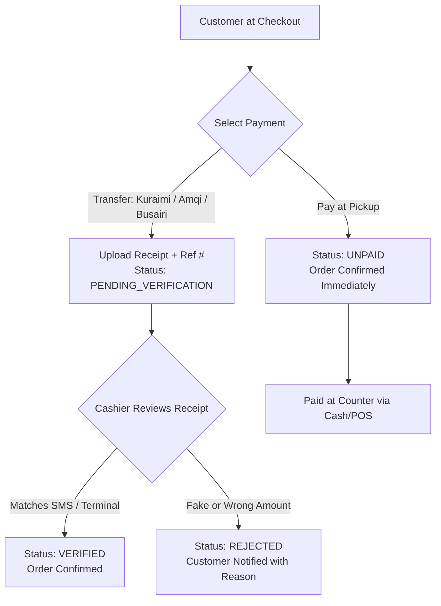

# Payment Architecture & Receipt Verification

## 1. Supported Payment Modalities (MVP)

---

## 2. Transfer Configuration Details

The system configures and presents official merchant accounts for local transfers:
1. **Kuraimi Bank (بنك الكريمي)**:
   - Account / Haseb Code: `PH-772207788`
   - Name: `مطعم بيتزا هاوس - المكلا`
2. **Al-Amqi Exchange (شركة العمقي للصرافة)**:
   - Account Number: `25401982`
   - Name: `بيتزا هاوس`
3. **Al-Busairi Exchange (شركة البسيري للصرافة)**:
   - Haseb / Wallet Code: `889104`
   - Name: `بيتزا هاوس فوه`

---

## 3. Cashier Verification Interface

Located at `/admin/payments`:
- Shows table of pending receipts with customer name, phone, order total, transfer reference ID, and submission timestamp.
- **Inspect Action**: Opens a zoomable modal displaying the uploaded receipt image side-by-side with order details.
- **Approve Action**:
  - One-click confirmation.
  - Updates `Payment.status = VERIFIED`, sets `verifiedAt = now()`, `verifiedBy = cashierSession`.
  - Automatically transitions order into `CONFIRMED` and queues it.
- **Reject Action**:
  - Requires selecting or entering a rejection reason (e.g. "المبلغ غير مطابق", "الصورة غير واضحة", "الحوالة ملغية").
  - Sets `Payment.status = REJECTED`, `Payment.rejectReason = reason`.
  - Live tracking screen updates to notify the customer with an option to upload a corrected receipt or switch to Pay at Pickup.
