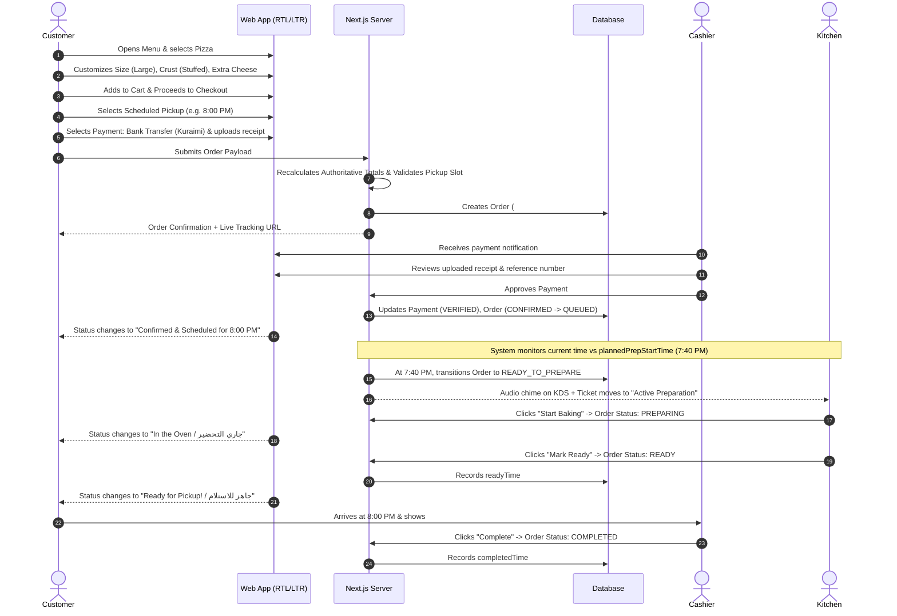

# User Flows & Operational Journeys

## 1. Customer Ordering Journey

---

## 2. Cashier Operations Journey (Payment Verification & Handover)

1. **Review Pending Transfers**:
   - Cashier navigates to `/admin/payments`.
   - List displays pending transfer orders with customer name, phone, amount in YER, reference number, and receipt thumbnail.
   - Cashier clicks thumbnail to open full-resolution receipt preview modal.
   - Cashier checks their merchant terminal/SMS alert:
     - **Match**: Cashier clicks `Approve Payment`. Order transitions to `CONFIRMED`.
     - **Mismatch / Fake**: Cashier clicks `Reject Payment`, enters a clear reason (e.g. "المبلغ غير مطابق" or "الرقم المرجعي غير موجود"). Order transitions to `REJECTED`, notifying customer on tracking screen.

2. **Customer Pickup Counter**:
   - Customer arrives and announces order reference (e.g. `#PH-1024`).
   - Cashier views `/admin/orders` or `/kitchen`.
   - If payment method was `PAY_AT_PICKUP`, cashier collects cash/card, marks paid, and clicks `Complete Order`.

---

## 3. Kitchen Operations Journey (KDS)

- Kitchen operates a wall-mounted tablet or large touch-screen at `/kitchen`.
- The screen has 4 high-contrast operational columns:
  1. **Scheduled / Upcoming**: Future orders awaiting their preparation window.
  2. **Ready to Prepare (الطلبات الجاهزة للبدء)**: Orders whose planned preparation start time has arrived. Displayed with a bold amber border and timer.
  3. **Preparing (قيد التحضير)**: Orders currently in the dough rolling, topping, or baking phase.
  4. **Ready for Pickup (جاهز للتسليم)**: Boxed orders waiting on the heated counter for customer pickup.
- Every state transition is executed with a single touch target.
